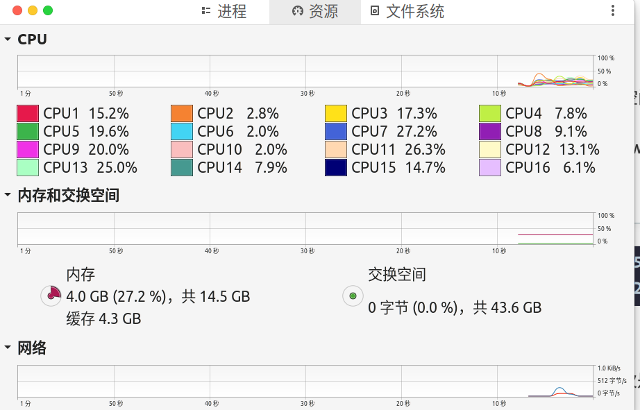
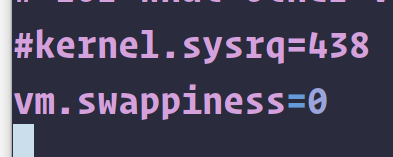
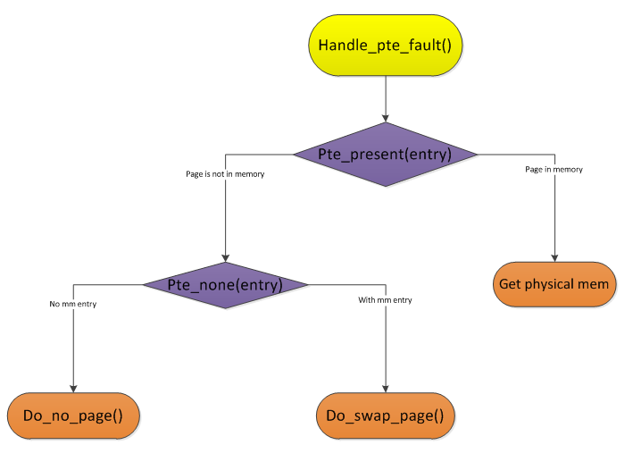

# 交换空间管理及基于linux的案例介绍

[TOC]

## 交换空间管理

交换空间技术出现在内存不够的年代。那个年代为了充分利用磁盘，开发更高效率的计算机，采取了这样一种交换空间技术。当程序试图在内存中添加东西而内存已经存满的时候（显然是另一个进程的请求），os必须决定需要把哪一个页交换到磁盘当中。这种技术就是交换技术，被分配的磁盘空间就是交换空间。

我们知道，磁盘远远慢于内存，但在那个年代，cpu处理数据的能力超过了内存可以存储的数据大小，通过交换空间，我们实质上是要达到一个适合cpu的数据吞吐量，从而更高效的利用cpu.

不同操作系统用不同的方式实现交换这一技术。

## linux

我们看看linux对交换空间技术的实现。

首先用`free -m`查看swap分区：


其中交换从左到右依次是分配大小、当前使用大小、剩余大小，内存则按照total used free shared buffers来排序。

当然我们也可以通过gnome-system-monitor 来查看：



我们可以通过swapon或者swapoff来开启或者关闭swap技术，通过更改/etc/sysctl.conf里面的swappiness的值来更改使用swap的大小，如



我的这个值为0，意味着假如我的内存使用了100-0=100%的时候才会启用交换空间。

下面主要看linux的实现。

这是swap的核心函数的call graph:




```c
vm_fault_t do_swap_page(struct vm_fault *vmf)
{
	struct vm_area_struct *vma = vmf->vma;
	struct page *page = NULL, *swapcache;
	struct swap_info_struct *si = NULL;
	swp_entry_t entry;
	pte_t pte;
	int locked;
	int exclusive = 0;
	vm_fault_t ret = 0;
	void *shadow = NULL;

	if (!pte_unmap_same(vmf))
		goto out;

	entry = pte_to_swp_entry(vmf->orig_pte);
	if (unlikely(non_swap_entry(entry))) {
		if (is_migration_entry(entry)) {
			migration_entry_wait(vma->vm_mm, vmf->pmd,
					     vmf->address);
		} else if (is_device_exclusive_entry(entry)) {
			vmf->page = pfn_swap_entry_to_page(entry);
			ret = remove_device_exclusive_entry(vmf);
		} else if (is_device_private_entry(entry)) {
			vmf->page = pfn_swap_entry_to_page(entry);
			ret = vmf->page->pgmap->ops->migrate_to_ram(vmf);
		} else if (is_hwpoison_entry(entry)) {
			ret = VM_FAULT_HWPOISON;
		} else {
			print_bad_pte(vma, vmf->address, vmf->orig_pte, NULL);
			ret = VM_FAULT_SIGBUS;
		}
		goto out;
	}

	/* Prevent swapoff from happening to us. */
	si = get_swap_device(entry);
	if (unlikely(!si))
		goto out;

	page = lookup_swap_cache(entry, vma, vmf->address);
	swapcache = page;

	if (!page) {
		if (data_race(si->flags & SWP_SYNCHRONOUS_IO) &&
		    __swap_count(entry) == 1) {
			/* skip swapcache */
			page = alloc_page_vma(GFP_HIGHUSER_MOVABLE, vma,
							vmf->address);
			if (page) {
				__SetPageLocked(page);
				__SetPageSwapBacked(page);

				if (mem_cgroup_swapin_charge_page(page,
					vma->vm_mm, GFP_KERNEL, entry)) {
					ret = VM_FAULT_OOM;
					goto out_page;
				}
				mem_cgroup_swapin_uncharge_swap(entry);

				shadow = get_shadow_from_swap_cache(entry);
				if (shadow)
					workingset_refault(page_folio(page),
								shadow);

				lru_cache_add(page);

				/* To provide entry to swap_readpage() */
				set_page_private(page, entry.val);
				swap_readpage(page, true);
				set_page_private(page, 0);
			}
		} else {
			page = swapin_readahead(entry, GFP_HIGHUSER_MOVABLE,
						vmf);
			swapcache = page;
		}

		if (!page) {
			/*
			 * Back out if somebody else faulted in this pte
			 * while we released the pte lock.
			 */
			vmf->pte = pte_offset_map_lock(vma->vm_mm, vmf->pmd,
					vmf->address, &vmf->ptl);
			if (likely(pte_same(*vmf->pte, vmf->orig_pte)))
				ret = VM_FAULT_OOM;
			goto unlock;
		}

		/* Had to read the page from swap area: Major fault */
		ret = VM_FAULT_MAJOR;
		count_vm_event(PGMAJFAULT);
		count_memcg_event_mm(vma->vm_mm, PGMAJFAULT);
	} else if (PageHWPoison(page)) {
		/*
		 * hwpoisoned dirty swapcache pages are kept for killing
		 * owner processes (which may be unknown at hwpoison time)
		 */
		ret = VM_FAULT_HWPOISON;
		goto out_release;
	}

	locked = lock_page_or_retry(page, vma->vm_mm, vmf->flags);

	if (!locked) {
		ret |= VM_FAULT_RETRY;
		goto out_release;
	}

	if (swapcache) {
		/*
		 * Make sure try_to_free_swap or swapoff did not release the
		 * swapcache from under us.  The page pin, and pte_same test
		 * below, are not enough to exclude that.  Even if it is still
		 * swapcache, we need to check that the page's swap has not
		 * changed.
		 */
		if (unlikely(!PageSwapCache(page) ||
			     page_private(page) != entry.val))
			goto out_page;

		/*
		 * KSM sometimes has to copy on read faults, for example, if
		 * page->index of !PageKSM() pages would be nonlinear inside the
		 * anon VMA -- PageKSM() is lost on actual swapout.
		 */
		page = ksm_might_need_to_copy(page, vma, vmf->address);
		if (unlikely(!page)) {
			ret = VM_FAULT_OOM;
			page = swapcache;
			goto out_page;
		}

		/*
		 * If we want to map a page that's in the swapcache writable, we
		 * have to detect via the refcount if we're really the exclusive
		 * owner. Try removing the extra reference from the local LRU
		 * pagevecs if required.
		 */
		if ((vmf->flags & FAULT_FLAG_WRITE) && page == swapcache &&
		    !PageKsm(page) && !PageLRU(page))
			lru_add_drain();
	}

	cgroup_throttle_swaprate(page, GFP_KERNEL);

	/*
	 * Back out if somebody else already faulted in this pte.
	 */
	vmf->pte = pte_offset_map_lock(vma->vm_mm, vmf->pmd, vmf->address,
			&vmf->ptl);
	if (unlikely(!pte_same(*vmf->pte, vmf->orig_pte)))
		goto out_nomap;

	if (unlikely(!PageUptodate(page))) {
		ret = VM_FAULT_SIGBUS;
		goto out_nomap;
	}

	/*
	 * Remove the swap entry and conditionally try to free up the swapcache.
	 * We're already holding a reference on the page but haven't mapped it
	 * yet.
	 */
	swap_free(entry);
	if (should_try_to_free_swap(page, vma, vmf->flags))
		try_to_free_swap(page);

	inc_mm_counter_fast(vma->vm_mm, MM_ANONPAGES);
	dec_mm_counter_fast(vma->vm_mm, MM_SWAPENTS);
	pte = mk_pte(page, vma->vm_page_prot);

	/*
	 * Same logic as in do_wp_page(); however, optimize for fresh pages
	 * that are certainly not shared because we just allocated them without
	 * exposing them to the swapcache.
	 */
	if ((vmf->flags & FAULT_FLAG_WRITE) && !PageKsm(page) &&
	    (page != swapcache || page_count(page) == 1)) {
		pte = maybe_mkwrite(pte_mkdirty(pte), vma);
		vmf->flags &= ~FAULT_FLAG_WRITE;
		ret |= VM_FAULT_WRITE;
		exclusive = RMAP_EXCLUSIVE;
	}
	flush_icache_page(vma, page);
	if (pte_swp_soft_dirty(vmf->orig_pte))
		pte = pte_mksoft_dirty(pte);
	if (pte_swp_uffd_wp(vmf->orig_pte)) {
		pte = pte_mkuffd_wp(pte);
		pte = pte_wrprotect(pte);
	}
	vmf->orig_pte = pte;

	/* ksm created a completely new copy */
	if (unlikely(page != swapcache && swapcache)) {
		page_add_new_anon_rmap(page, vma, vmf->address, false);
		lru_cache_add_inactive_or_unevictable(page, vma);
	} else {
		do_page_add_anon_rmap(page, vma, vmf->address, exclusive);
	}

	set_pte_at(vma->vm_mm, vmf->address, vmf->pte, pte);
	arch_do_swap_page(vma->vm_mm, vma, vmf->address, pte, vmf->orig_pte);

	unlock_page(page);
	if (page != swapcache && swapcache) {
		/*
		 * Hold the lock to avoid the swap entry to be reused
		 * until we take the PT lock for the pte_same() check
		 * (to avoid false positives from pte_same). For
		 * further safety release the lock after the swap_free
		 * so that the swap count won't change under a
		 * parallel locked swapcache.
		 */
		unlock_page(swapcache);
		put_page(swapcache);
	}

	if (vmf->flags & FAULT_FLAG_WRITE) {
		ret |= do_wp_page(vmf);
		if (ret & VM_FAULT_ERROR)
			ret &= VM_FAULT_ERROR;
		goto out;
	}

	/* No need to invalidate - it was non-present before */
	update_mmu_cache(vma, vmf->address, vmf->pte);
unlock:
	pte_unmap_unlock(vmf->pte, vmf->ptl);
out:
	if (si)
		put_swap_device(si);
	return ret;
out_nomap:
	pte_unmap_unlock(vmf->pte, vmf->ptl);
out_page:
	unlock_page(page);
out_release:
	put_page(page);
	if (page != swapcache && swapcache) {
		unlock_page(swapcache);
		put_page(swapcache);
	}
	if (si)
		put_swap_device(si);
	return ret;
}
```


