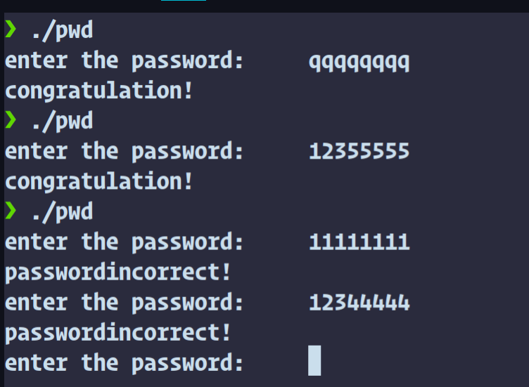
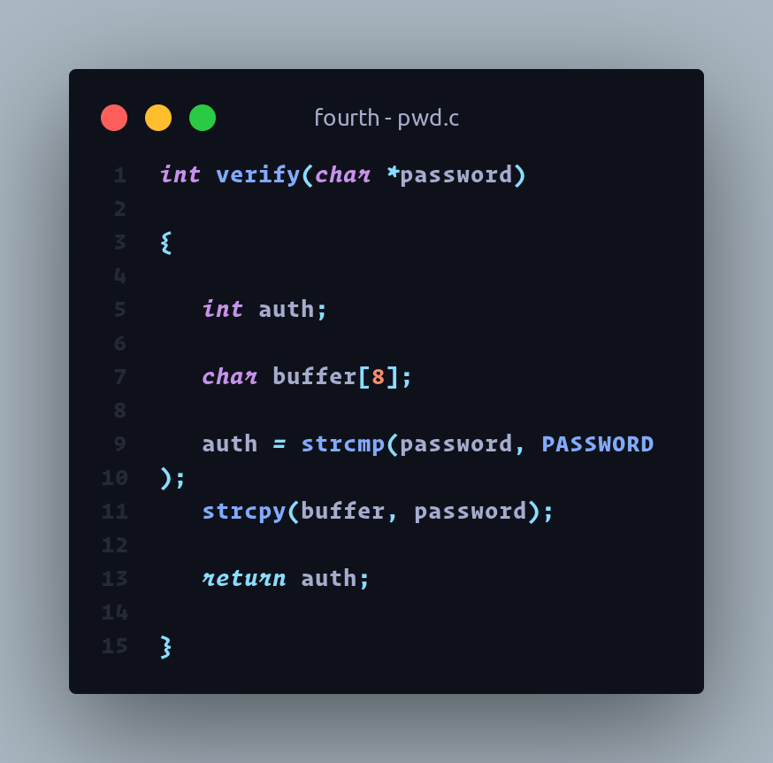
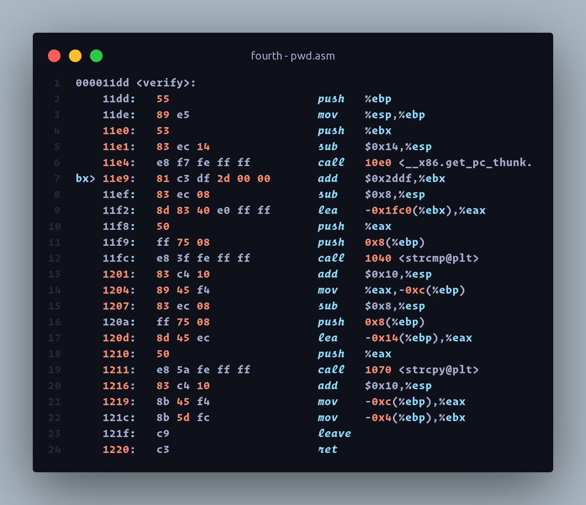
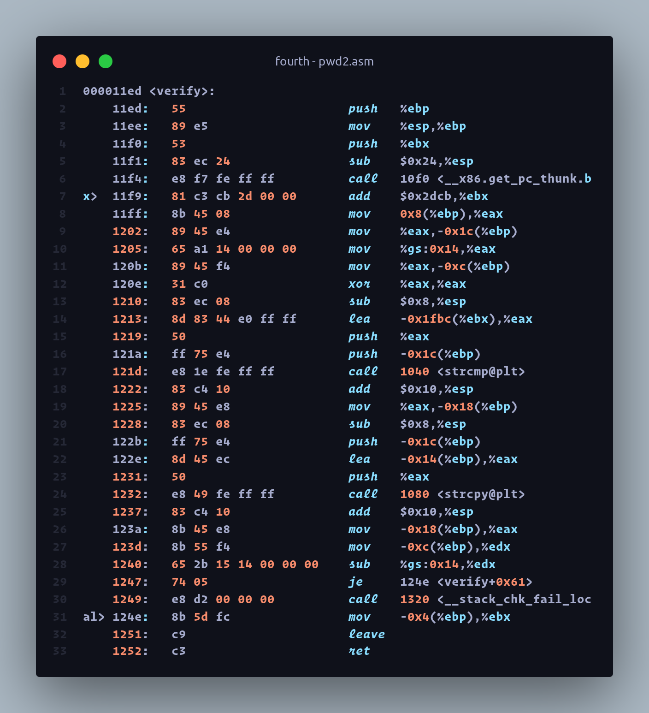

[TOC]

# 原因及规律

题目演示：



## c程序解释

pass[1024]用于存储输入的字符串，verify通过对输入的字符串进行strcmp比较，实现验证字符串是否是预定义的password。值得注意的是：

```c
 strcpy(buffer, password);
```

这一句显然容易产生缓冲区溢出的问题。

strcmp函数在str1=str2的时候返回，str1<str2的时候返回负数，str1>str2的时候返回正数。

**注意**：strcpy以二进制的方式比较大小，由于小端法，strcmp相当于将两个[字符](https://baike.baidu.com/item/字符)串自左向右逐个字符相比（按ASCII值大小相比较），直到出现不同的字符或遇'\0'为止

strcpy函数用于把str2的值赋给str1,其声明是这样的：

```c
char *strcpy(char *dest, const char *src)
```

显然该函数本身并未进行数据大小检查，可以预料到当把pass[1024]的首地址赋值给buffer的首地址时，会产生错误。

**注意：** '\0'是字符串的结束符，任何字符串之后都会自动加上'\0'



## 编译参数解释

`-fno-stack-protector` disables stack protection.

`-z` is passed directly to the linker along with the keyword execstack.

`execstack`用于显示的指定程序需要executable stack

`-z execstack `意味着需要在链接时执行。

## 原因解释及规律

显然，由于预定义的密码是1234567这7个数，那么按照常理来说无论如何8个数字的输入都不应该被接受，那么唯一的可能是产生了一些溢出，使函数verify返回的auth的值被覆盖。

我们不妨上$gdb$

重新编译，加上调试参数-g:

```shell
❯ gcc -m32 -g -fno-stack-protector -zexecstack -o pwd pwd.c
```

调试过程：

```shell
❯ gdb -q pwd
Reading symbols from pwd...
(gdb) break 19
Breakpoint 1 at 0x1207: file pwd.c, line 19.
(gdb) run
Starting program: /home/heeler/文档/code/lab/cs-disscussion/fourth/pwd 
[Thread debugging using libthread_db enabled]
Using host libthread_db library "/lib/x86_64-linux-gnu/libthread_db.so.1".
enter the password:     qqqqqqqq

Breakpoint 1, verify (password=0xffffc49c "qqqqqqqq") at pwd.c:19
19         strcpy(buffer, password);
(gdb) x/8bt &auth
0xffffc46c:     00000001        00000000        00000000        00000000        00000000        11010000 11111111 11110111
(gdb) s
21         return auth;
(gdb) x/8bt &auth
0xffffc46c:     00000000        00000000        00000000        00000000        00000000        11010000 11111111 11110111
```

可以看到，输入qqqqqqqq时，在strcpy之前，auth为正常值(qqqqqqq>1234567)=1,buffer随机值，而step后，auth被覆盖为0,返回，密码输入正确。

可想而知，只要我们输入的字符串的前7个字符大于等于1234567即可（strcmp），且必须是大于7个字符的字符串（为了使buffer字符串的'\0'能够覆盖auth的值。）

演示：

```shell
❯ ./pwd
enter the password:     12345677            #1234567==1234567，输入正确，但原因是buffer的'\0'覆盖了原先的0
congratulation!
❯ ./pwd
enter the password:     1233333             #1233333<1234567,且未覆盖
passwordincorrect!
enter the password:     12333333            #12333333<1234567,但覆盖了
passwordincorrect!
enter the password:     1234577             #1234577>1234567,未覆盖
passwordincorrect!
enter the password:     12345777            #12345777>1234567,但覆盖了
congratulation!
```


# 汇编代码解释

先反汇编：

```shell
❯ objdump -d pwd > pwd.asm
❯ objdump -d pwd2 > pwd2.asm
```

pwd.asm存储关闭缓冲区溢出保护后进行编译产生的程序的反汇编代码，

pwd2.asm存储正常编译后产生的程序的反汇编代码。

显然为了偷懒，我们可以只分析verify函数的反汇编代码。

[pwd.asm](./pwd.asm):



[pwd2.asm](./pwd2.asm)



[pwd.asm](./pwd.asm):

```shell

000011dd <verify>:
    11dd:	55                   	push   %ebp                             压栈 
    11de:	89 e5                	mov    %esp,%ebp                        栈帧
    11e0:	53                   	push   %ebx                             压函数栈
    11e1:	83 ec 14             	sub    $0x14,%esp                       esp-20开辟空间
    11e4:	e8 f7 fe ff ff       	call   10e0 <__x86.get_pc_thunk.bx>     调用这个函数，目测是PASSWORD,详见参考3
    11e9:	81 c3 df 2d 00 00    	add    $0x2ddf,%ebx                     ebx+2ddf
    11ef:	83 ec 08             	sub    $0x8,%esp                        esp-8开辟buffer空间
    11f2:	8d 83 40 e0 ff ff    	lea    -0x1fc0(%ebx),%eax               以-0x1fc0(%ebx)为地址加载到eax
    11f8:	50                   	push   %eax                             压函数strcmp的栈
    11f9:	ff 75 08             	push   0x8(%ebp)                        password
    11fc:	e8 3f fe ff ff       	call   1040 <strcmp@plt>                调用strcmp
    1201:	83 c4 10             	add    $0x10,%esp                       esp指针加16
    1204:	89 45 f4             	mov    %eax,-0xc(%ebp)                  -0xc(%ebp)以eax的值为地址，auth存到了距离ebp有12的地方,此时ebp esp距离12
    1207:	83 ec 08             	sub    $0x8,%esp                        esp-8继续开辟空间
    120a:	ff 75 08             	push   0x8(%ebp)                        password
    120d:	8d 45 ec             	lea    -0x14(%ebp),%eax                 以-0x14(%ebp)为地址加载到eax，buffer[8]数组
    1210:	50                   	push   %eax                             压strcpy的栈
    1211:	e8 5a fe ff ff       	call   1070 <strcpy@plt>                调用strcpy
    1216:	83 c4 10             	add    $0x10,%esp                       esp+16,此时ebp与esp 距离为20+8-16+8-16=4,出现栈溢出
    1219:	8b 45 f4             	mov    -0xc(%ebp),%eax                  buffer
    121c:	8b 5d fc             	mov    -0x4(%ebp),%ebx                  程序认为的auth给到寄存器ebx
    121f:	c9                   	leave  
    1220:	c3                   	ret    

```


[pwd2.asm](./pwd2.asm)

```shell
000011ed <verify>:
    11ed:	55                   	push   %ebp                              压栈
    11ee:	89 e5                	mov    %esp,%ebp                         栈帧
    11f0:	53                   	push   %ebx                              压函数栈
    11f1:	83 ec 24             	sub    $0x24,%esp                        开辟空间
    11f4:	e8 f7 fe ff ff       	call   10f0 <__x86.get_pc_thunk.bx>      PASSWORD
    11f9:	81 c3 cb 2d 00 00    	add    $0x2dcb,%ebx                      ebx+0x2dcb
    11ff:	8b 45 08             	mov    0x8(%ebp),%eax                    以0x8(%ebp)为地址的值给eax          
    1202:	89 45 e4             	mov    %eax,-0x1c(%ebp)                  eax的值给到-0x1c(%ebp)
    1205:	65 a1 14 00 00 00    	mov    %gs:0x14,%eax                     %gs是段寄存器，可以看到这时已经不一样了
    120b:	89 45 f4             	mov    %eax,-0xc(%ebp)                   eax的值给到-0xc(%ebp)
    120e:	31 c0                	xor    %eax,%eax                         eax自我抑或，相当于eax=0
    1210:	83 ec 08             	sub    $0x8,%esp                         esp-8开辟空间，buffer[8]
    1213:	8d 83 44 e0 ff ff    	lea    -0x1fbc(%ebx),%eax                以-0x1fbc(%ebx)为地址的值加载到eax
    1219:	50                   	push   %eax                              压函数strcmp栈
    121a:	ff 75 e4             	push   -0x1c(%ebp)                       password
    121d:	e8 1e fe ff ff       	call   1040 <strcmp@plt>                 调用strcmp
    1222:	83 c4 10             	add    $0x10,%esp                        esp+16
    1225:	89 45 e8             	mov    %eax,-0x18(%ebp)                  eax的值给到-0x18(%ebp)，auth存到-0x18(%ebp),即距离ebp有24
    1228:	83 ec 08             	sub    $0x8,%esp                         esp-8开辟空间 36+8-16+8
    122b:	ff 75 e4             	push   -0x1c(%ebp)                       压栈
    122e:	8d 45 ec             	lea    -0x14(%ebp),%eax                  以-0x14(%ebp)为地址的值给到eax
    1231:	50                   	push   %eax                              压栈
    1232:	e8 49 fe ff ff       	call   1080 <strcpy@plt>                 调用strcpy函数
    1237:	83 c4 10             	add    $0x10,%esp                        esp+16,此时buffer[8]占用到auth的地址(ebp与esp相差36+8-16+8-16=20)，而刚刚auth存到距离ebp有24的位置，此时出现栈溢出
    123a:	8b 45 e8             	mov    -0x18(%ebp),%eax                  以-0x18(%ebp)给到eax，应该是buffer的值
    123d:	8b 55 f4             	mov    -0xc(%ebp),%edx                   以-0xc(%ebp)给到edx
    1240:	65 2b 15 14 00 00 00 	sub    %gs:0x14,%edx                     刚刚的段寄存器，不太清楚是在干什么，目测和溢出有关所以调用段寄存器
    1247:	74 05                	je     124e <verify+0x61>                跳转
    1249:	e8 d2 00 00 00       	call   1320 <__stack_chk_fail_local>     调用stack相关函数，处理栈溢出问题
    124e:	8b 5d fc             	mov    -0x4(%ebp),%ebx                   以-0x4(%ebp)给到ebx,此时经stack相关函数处理后auth正常
    1251:	c9                   	leave  
    1252:	c3                   	ret    

```


# 其他编译器的缓冲区溢出保护功能

你们测试测试

# 参考

·[参数解释1](https://developer.arm.com/documentation/dui0774/k/Compiler-Command-line-Options/-fstack-protector---fstack-protector-all---fstack-protector-strong---fno-stack-protector)

[参数解释2](https://stackoverflow.com/questions/29178445/what-is-the-z-option-for-in-this-gcc-compiler-command)

[汇编代码<__i686.get_pc_thunk.bx>.解释](https://stackoverflow.com/questions/6679846/what-is-i686-get-pc-thunk-bx-why-do-we-need-this-call)