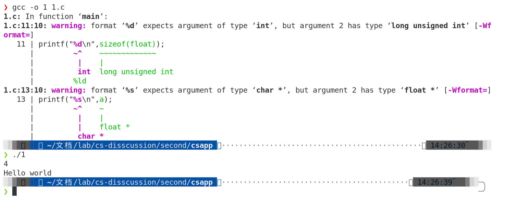
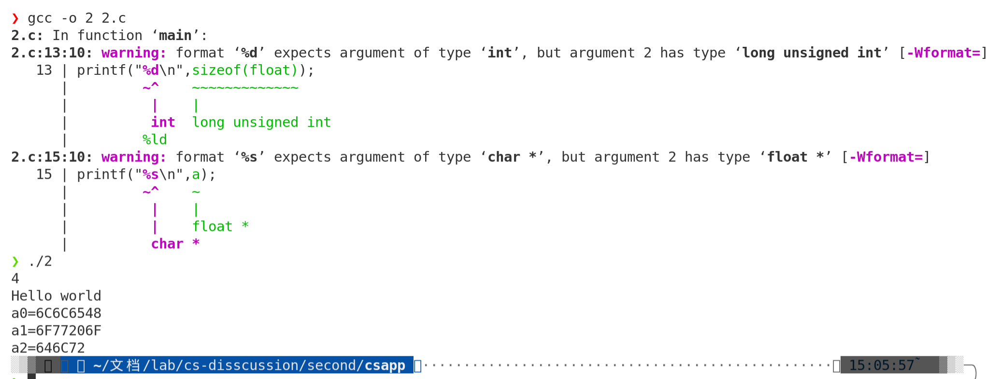
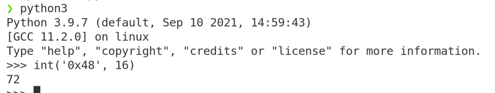
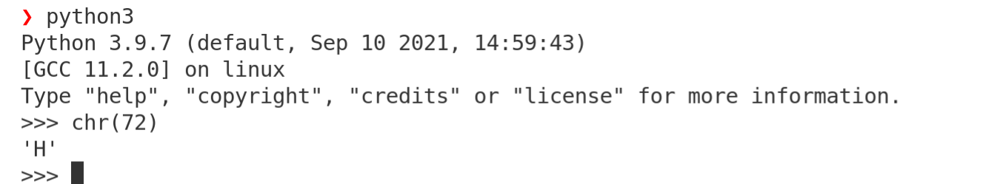
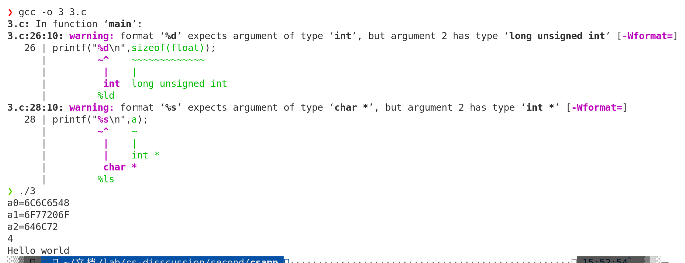
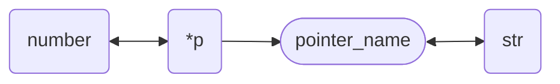
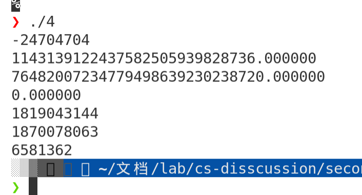

[TOC]

# 计算机系统第二次小班讨论

参考网址：

[ieee浮点数格式转换](https://www.h-schmidt.net/FloatConverter/IEEE754.html)

[进制转换网站](https://tool.oschina.net/hexconvert/)

## 运行程序



分析：

显然第一行的4是float的size

第二行，由于赋值时给a数组定义的类型为float，但输出时以%s的字符串为类型输出，因此会出现==hello world== 这样奇怪的输出。

让我们看看为什么会输出hello world:

首先这是a[3]={1143139122437582505939828736.0,76482007234779498639230238720.0,9.222452464*e**-*39}

在1.c中添加如下代码作为[2.c](./2.c)来查看a数组的表示：

```c
unsigned int *a0 = (unsigned int*)&a[0];
printf("a0=%X\n",*a0);


unsigned int *a1 = (unsigned int*)&a[1];
printf("a1=%X\n",*a1);


unsigned int *a2 = (unsigned int*)&a[2];
printf("a2=%X\n",*a2);
```

编译运行结果如下：



而由于现代操作系统大都采用小端法存储数据，因此其在内存中的表示应该是：

|      | 从   | 右   | 到   | 左   |
| ---- | ---- | ---- | ---- | ---- |
| a0   | 0x48 | 0x65 | 0x6c | 0x6c |
| a1   | 0x6f | 0x20 | 0x77 | 0x6f |
| a2   | 0x72 | 0x6c | 0x64 | 0x00 |

转为10进制：



|      | 从   | 右   | 到   | 左   |
| ---- | ---- | ---- | ---- | ---- |
| a0   | 72   | 101  | 108  | 108  |
| a1   | 111  | 32   | 119  | 111  |
| a2   | 114  | 108  | 100  | 0    |

转为ascii码：



|      | 从   | 右   | 到   | 左   |
| ---- | ---- | ---- | ---- | ---- |
| a0   | H    | e    | l    | l    |
| a1   | o    | ' '  | w    | o    |
| a2   | r    | l    | d    |      |

因此会输出这样的结果

## int

显然，我们只要把数据该为int存在内存时对应于hello world的数据即可，代码为[3.c](./3.c)

```c


#include <stdio.h>

int main()

{

int   a[3]={1819043144,1870078063,6581362};

unsigned int *a0 = (unsigned int*)&a[0];
printf("a0=%X\n",*a0);


unsigned int *a1 = (unsigned int*)&a[1];
printf("a1=%X\n",*a1);


unsigned int *a2 = (unsigned int*)&a[2];
printf("a2=%X\n",*a2);


printf("%d\n",sizeof(float));

printf("%s\n",a);


return 0;

}
```




## 代码

代码解释：




```c
#include <stdio.h>
#include <stdlib.h>
#include <string.h>
int main()
{
	char str[20]={"Hello world"};
	printf("%d\n",&str);
	float *xp,*yp,*zp;
	float a[3];
	xp=str;yp=(str+4);zp=(str+8);
	a[0]=*xp;
	a[1]=*yp;
	a[2]=*zp;
	printf("%f\n",a[0]);
	printf("%f\n",a[1]);
	printf("%f\n",a[2]);
    int *xx,*yy,*zz;
    int b[3];
    xx=str;yy=(str+4);zz=(str+8);
	b[0]=*xx;
	b[1]=*yy;
	b[2]=*zz;
	printf("%d\n",b[0]);
	printf("%d\n",b[1]);
	printf("%d\n",b[2]);
	return 0;
}
```




## 指令

我觉得会,但我不会


