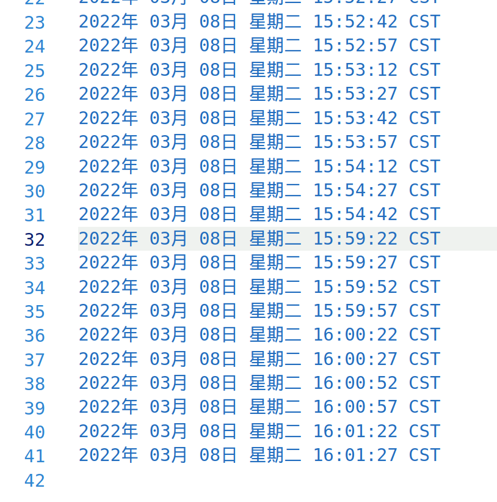

# linux进程相关

[TOC]

参考网址：

[developer](https://developer.ibm.com/tutorials/l-lpic1-103-5/) 

[掘金](https://juejin.cn/post/6912612368996368392)

**主讲人：刘锦乐**

## 查看进程

先来看看linux下怎么查看进程：

```
ps -ef | grep {programname}
```

其中ps是==process status==的缩写,用于查看进程，`| gerp`用于连接，上面的命令用于查询指定程序的相关进程，如查询firefox:

上图截取一部分


其中信息按照下面的方式排列：

```
UID    PID PPID C STIME TTY     TIME CMD
```

即进程创建的用户id,进程的pid,该进程的父进程的id，c指cpu占用率，stime是进程启动时间，tty代表终端（？即本地终端）,time指进程占用cpu的总时间，cmd就是command,在linux中就是这样的一个路径显示,比如我输入

```
/usr/lib/firefox/firefox
```

就会启动firefox


## 创建进程

### c

下面以c为例子，讲解如何创建进程.

```c
void test_fork_1()
{
	fork();
	fork();
	fork();
	// "hello"的打印次数等于创建的进程数,进程总数为2^n,其中n是fork调用的数目
	fprintf(stdout, "hello\n"); // 注:总共会输出8次hello
}
```

由于fork会从其所在的行创建一个子进程，所以上面代码会创建总共$2^{n}=8$个子进程。

我们用fork函数写一个[1.c](./1.c)文件：

```c
#include <unistd.h>
#include <sys/types.h>
#include <stdio.h>
int main( ){
   pid_t child_pid;
   child_pid = fork (); // Create a new child process;
   if (child_pid < 0) {
      printf("fork failed");
      return 1;
   } else if (child_pid == 0) {
      printf ("child process successfully created!\n");
      printf ("child_PID = %d,parent_PID = %d\n",
      getpid(), getppid( ) );
   } else {
      wait(NULL);
      printf ("parent process successfully created!\n");
      printf ("child_PID = %d, parent_PID = %d", getpid( ), getppid( ) );
   }
   return 0;
}
```

结果：


### linux脚本

下面展示linux下在父进程被杀死的情况下子进程仍可以运行的方法：

先写一个[2.sh](./2.sh)脚本：

```
while sleep 30; do date;done
```

以该脚本为例，执行两次,

```
nohup sh 2.sh&
nohup zsh 2.sh&
```

可以看到两个进程的父进程都是85048


下面我们杀掉85048进程：




可以看到子进程仍在执行

### 父子进程

以[3.c](./3.c)为例子，讲解linux对于简单情况下父子进程中虚拟地址空间的处理：

```
#include <unistd.h>
#include <stdio.h>


int main(){
	// 创建进程
	pid_t pid = fork();

	// 局部变量
	int num = 10;

	// 判断当前进程是父进程 还是子进程
	if (pid > 0){			// 进程号 > 0，即为子进程的进程号，当前为父进程
		printf("I am parent process, pid: %d, ppid: %d\n", getpid(), getppid());

		printf("parent process num : %d\n", num);
		num += 10;
		printf("parent process num + 10 : %d\n", num);

	}
	else if (pid == 0){		// 进程号 == 0，表示当前为子进程
		printf("I am child process, pid: %d, ppid: %d\n", getpid(), getppid());

		printf("child process num : %d\n", num);
		num += 100;
		printf("child process num + 100 : %d\n", num);
	}
	
	return 0;
}

```

代码执行结果：


linux采取的策略是 **读时共享，写时拷贝**，即仅在对子进程执行写操作时才复制父进程的内容到子进程，否则只是pid不同（对于fork来讲）

## 无限创建进程

由于fork方便创建进程，我们仍以c中的fork为例，尝试用无限循环创建进程：

在[4.c](./4.c)中，

```c
#include <unistd.h>
#include <sys/types.h>
#include <stdio.h>
int main( ){
   pid_t child_pid;
   while(1){
   child_pid = fork (); // Create a new child process;
   if (child_pid < 0) {
      printf("fork failed");
      return 1;
   } else if (child_pid == 0) {
      printf ("child process successfully created!\n");
      printf ("child_PID = %d,parent_PID = %d\n",
      getpid(), getppid( ) );
   } else {
      wait(NULL);
      printf ("parent process successfully created!\n");
      printf ("child_PID = %d, parent_PID = %d", getpid( ), getppid( ) );
   }
   }
   return 0;
}
```

 正常执行cpu状况：


无限循环结果：


可以看到运行几十秒后我的cpu占用以及有了明显的变化。而由于CPU的寻址空间是有限的，所以不能无限创进程。

## 问题

### 一、

进程是什么？为什么在终端`pkill firefox`后火狐浏览器就自己关闭了？

### 二、

如果cpu等硬件资源无限，能否创建无限多的进程？


