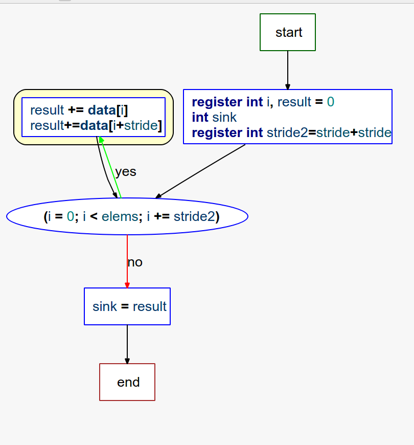
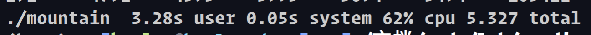

[TOC]

# 绘制存储器山

建议每一个人都绘制

去[CMU](https://www.cs.cmu.edu/afs/cs/academic/class/15213-f05/code/mem/mountain/)下载所有文件，按照readme操作

```shell
./mountain > 111.txt
```


得到数据111.txt,

plot.py画图，


# 分析

安装oprofile

```
sudo apt-get install oprofile
```

显然，我的oprofile版本高，无法使用opcontrol

```shell
sudo operf ./mountain
```

之后opreport -l列出所有symbols

```
❯ opreport -l
Using /home/heeler/文档/code/lab/cs-disscussion/sixth/oprofile_data/samples/ for samples directory.
warning: /kvm could not be found.
CPU: AMD64 generic, speed 3200 MHz (estimated)
Counted CPU_CLK_UNHALTED events (CPU Clocks not Halted) with a unit mask of 0x00 (No unit mask) count 100000
samples  %        image name               symbol name
138966   94.4293  mountain                 test
8133      5.5265  mountain                 main
12        0.0082  libc.so.6                __printf_fp_l
11        0.0075  mountain                 fcyc2_full
8         0.0054  mountain                 add_sample
7         0.0048  mountain                 get_counter
5         0.0034  mountain                 start_counter
4         0.0027  kvm                      /kvm
2         0.0014  libc.so.6                __mempcpy_avx_unaligned_erms
2         0.0014  libc.so.6                __memset_avx2_unaligned_erms
2         0.0014  libc.so.6                __printf_chk
1        6.8e-04  ld-linux-x86-64.so.2     _dl_allocate_tls_storage
1        6.8e-04  ld-linux-x86-64.so.2     do_lookup_x
1        6.8e-04  ld-linux-x86-64.so.2     strcmp
1        6.8e-04  libc.so.6                _IO_file_xsputn@@GLIBC_2.2.5
1        6.8e-04  libc.so.6                __memcpy_avx_unaligned_erms
1        6.8e-04  libc.so.6                __mpn_lshift
1        6.8e-04  libc.so.6                __mpn_mul
1        6.8e-04  libc.so.6                __mpn_mul_1
1        6.8e-04  libc.so.6                __vfprintf_internal
1        6.8e-04  libc.so.6                _int_free
1        6.8e-04  libc.so.6                free
1        6.8e-04  libc.so.6                hack_digit
```

可以看到test占用了大部分时间

更为详细的版本：

```
❯ opreport -c   -% -f -g -s sample
Using /home/heeler/文档/code/lab/cs-disscussion/sixth/oprofile_data/samples/ for samples directory.
warning: /kvm could not be found.
CPU: AMD64 generic, speed 3200 MHz (estimated)
Counted CPU_CLK_UNHALTED events (CPU Clocks not Halted) with a unit mask of 0x00 (No unit mask) count 100000
samples  %        linenr info                 image name               symbol name
-------------------------------------------------------------------------------
138966   94.4293  (no location information)   /home/heeler/文档/code/lab/cs-disscussion/sixth/mountain test
  138966   94.4293  (no location information)   /home/heeler/文档/code/lab/cs-disscussion/sixth/mountain test [self]
-------------------------------------------------------------------------------
8133      5.5265  (no location information)   /home/heeler/文档/code/lab/cs-disscussion/sixth/mountain main
  8133      5.5265  (no location information)   /home/heeler/文档/code/lab/cs-disscussion/sixth/mountain main [self]
-------------------------------------------------------------------------------
12        0.0082  (no location information)   /usr/lib/x86_64-linux-gnu/libc.so.6 __printf_fp_l
  12        0.0082  (no location information)   /usr/lib/x86_64-linux-gnu/libc.so.6 __printf_fp_l [self]
-------------------------------------------------------------------------------
11        0.0075  (no location information)   /home/heeler/文档/code/lab/cs-disscussion/sixth/mountain fcyc2_full
  11        0.0075  (no location information)   /home/heeler/文档/code/lab/cs-disscussion/sixth/mountain fcyc2_full [self]
-------------------------------------------------------------------------------
8         0.0054  (no location information)   /home/heeler/文档/code/lab/cs-disscussion/sixth/mountain add_sample
  8         0.0054  (no location information)   /home/heeler/文档/code/lab/cs-disscussion/sixth/mountain add_sample [self]
-------------------------------------------------------------------------------
7         0.0048  (no location information)   /home/heeler/文档/code/lab/cs-disscussion/sixth/mountain get_counter
  7         0.0048  (no location information)   /home/heeler/文档/code/lab/cs-disscussion/sixth/mountain get_counter [self]
-------------------------------------------------------------------------------
5         0.0034  (no location information)   /home/heeler/文档/code/lab/cs-disscussion/sixth/mountain start_counter
  5         0.0034  (no location information)   /home/heeler/文档/code/lab/cs-disscussion/sixth/mountain start_counter [self]
-------------------------------------------------------------------------------
4         0.0027  (no location information)   /kvm                     /kvm
  4         0.0027  (no location information)   /kvm                     /kvm [self]
-------------------------------------------------------------------------------
2         0.0014  (no location information)   /usr/lib/x86_64-linux-gnu/libc.so.6 __mempcpy_avx_unaligned_erms
  2         0.0014  (no location information)   /usr/lib/x86_64-linux-gnu/libc.so.6 __mempcpy_avx_unaligned_erms [self]
-------------------------------------------------------------------------------
2         0.0014  (no location information)   /usr/lib/x86_64-linux-gnu/libc.so.6 __memset_avx2_unaligned_erms
  2         0.0014  (no location information)   /usr/lib/x86_64-linux-gnu/libc.so.6 __memset_avx2_unaligned_erms [self]
-------------------------------------------------------------------------------
2         0.0014  (no location information)   /usr/lib/x86_64-linux-gnu/libc.so.6 __printf_chk
  2         0.0014  (no location information)   /usr/lib/x86_64-linux-gnu/libc.so.6 __printf_chk [self]
-------------------------------------------------------------------------------
1        6.8e-04  (no location information)   /usr/lib/x86_64-linux-gnu/ld-linux-x86-64.so.2 _dl_allocate_tls_storage
  1        6.8e-04  (no location information)   /usr/lib/x86_64-linux-gnu/ld-linux-x86-64.so.2 _dl_allocate_tls_storage [self]
-------------------------------------------------------------------------------
1        6.8e-04  dl-lookup.c:0               /usr/lib/x86_64-linux-gnu/ld-linux-x86-64.so.2 do_lookup_x
  1        6.8e-04  dl-lookup.c:0               /usr/lib/x86_64-linux-gnu/ld-linux-x86-64.so.2 do_lookup_x [self]
-------------------------------------------------------------------------------
1        6.8e-04  (no location information)   /usr/lib/x86_64-linux-gnu/ld-linux-x86-64.so.2 strcmp
  1        6.8e-04  (no location information)   /usr/lib/x86_64-linux-gnu/ld-linux-x86-64.so.2 strcmp [self]
-------------------------------------------------------------------------------
1        6.8e-04  (no location information)   /usr/lib/x86_64-linux-gnu/libc.so.6 _IO_file_xsputn@@GLIBC_2.2.5
  1        6.8e-04  (no location information)   /usr/lib/x86_64-linux-gnu/libc.so.6 _IO_file_xsputn@@GLIBC_2.2.5 [self]
-------------------------------------------------------------------------------
1        6.8e-04  (no location information)   /usr/lib/x86_64-linux-gnu/libc.so.6 __memcpy_avx_unaligned_erms
  1        6.8e-04  (no location information)   /usr/lib/x86_64-linux-gnu/libc.so.6 __memcpy_avx_unaligned_erms [self]
-------------------------------------------------------------------------------
1        6.8e-04  (no location information)   /usr/lib/x86_64-linux-gnu/libc.so.6 __mpn_lshift
  1        6.8e-04  (no location information)   /usr/lib/x86_64-linux-gnu/libc.so.6 __mpn_lshift [self]
-------------------------------------------------------------------------------
1        6.8e-04  (no location information)   /usr/lib/x86_64-linux-gnu/libc.so.6 __mpn_mul
  1        6.8e-04  (no location information)   /usr/lib/x86_64-linux-gnu/libc.so.6 __mpn_mul [self]
-------------------------------------------------------------------------------
1        6.8e-04  (no location information)   /usr/lib/x86_64-linux-gnu/libc.so.6 __mpn_mul_1
  1        6.8e-04  (no location information)   /usr/lib/x86_64-linux-gnu/libc.so.6 __mpn_mul_1 [self]
-------------------------------------------------------------------------------
1        6.8e-04  (no location information)   /usr/lib/x86_64-linux-gnu/libc.so.6 __vfprintf_internal
  1        6.8e-04  (no location information)   /usr/lib/x86_64-linux-gnu/libc.so.6 __vfprintf_internal [self]
-------------------------------------------------------------------------------
1        6.8e-04  malloc.c:0                  /usr/lib/x86_64-linux-gnu/libc.so.6 _int_free
  1        6.8e-04  malloc.c:0                  /usr/lib/x86_64-linux-gnu/libc.so.6 _int_free [self]
-------------------------------------------------------------------------------
1        6.8e-04  (no location information)   /usr/lib/x86_64-linux-gnu/libc.so.6 free
  1        6.8e-04  (no location information)   /usr/lib/x86_64-linux-gnu/libc.so.6 free [self]
-------------------------------------------------------------------------------
1        6.8e-04  printf_fp.c:0               /usr/lib/x86_64-linux-gnu/libc.so.6 hack_digit
  1        6.8e-04  printf_fp.c:0               /usr/lib/x86_64-linux-gnu/libc.so.6 hack_digit [self]
-------------------------------------------------------------------------------
```

显然性能瓶颈在test

test在mountain.c中：

```c
/* $begin mountainfuns */
void test(int elems, int stride) /* The test function */
{
    int i, result = 0; 
    volatile int sink; 

    for (i = 0; i < elems; i += stride)
	result += data[i];
    sink = result; /* So compiler doesn't optimize away the loop */
}
```

可以看到最后的注释写着“因此编译器不会优化这个循环”

那么优化循环即可。

不难发现循环是取0,stride,2*stride... elems//stride *stride为索引后累加到result上

除了一般人可以想到的减少循环次数（如一次循环对result累加两次）,其实我们还可以去掉volatile，（该关键字告诉编译器不用优化），并使用register关键字来声明int

```c
void test(int elems, int stride){

    register int i, result = 0; 
    register int sink; 
    register int stride2=stride+stride;
    for (i = 0; i < elems; i += stride2){
        result += data[i];
        result+=data[i+stride];
    }
	
    sink = result; /* So compiler doesn't optimize away the loop */
}
```

优化至只占87%

```c
└─[$]> opreport -l
Using /home/heeler/文档/code/lab/cs-disscussion/sixth/oprofile_data/samples/ for samples directory.
warning: /kvm could not be found.
CPU: AMD64 generic, speed 3200 MHz (estimated)
Counted CPU_CLK_UNHALTED events (CPU Clocks not Halted) with a unit mask of 0x00 (No unit mask) count 100000
samples  %        image name               symbol name
11046    87.6736  mountain                 test
1540     12.2232  mountain                 main
3         0.0238  mountain                 start_counter
2         0.0159  libc.so.6                __printf_fp_l
2         0.0159  libc.so.6                __vfprintf_internal
1         0.0079  kvm                      /kvm
1         0.0079  ld-linux-x86-64.so.2     do_lookup_x
1         0.0079  libc.so.6                __mpn_divrem
1         0.0079  libc.so.6                _int_free
1         0.0079  libc.so.6                calloc
1         0.0079  mountain                 get_counter
```

`time ./mountain`生成时间

优化前：


采用上述优化后：


实际上，我们可以大胆一点，在makefile里开启o3甚至o4优化：


需要指出的是，开启o3优化后性能提升并没有那么明显，实际并没有多大用。

~~老子要用优化卷死你们~~

我们还能做些什么？

这是test的call graph:


这是test的控制流图：



在run函数里面，我们可以看到test实际上就是一个warmup the cache的作用。

那么我也没有什么办法优化了。。。。

值得一提的是，我看到某些同学使用gpu进行并行的矩阵优化，然而并行优化仅在矩阵相乘这种无需条件判断的情况下有较大性能提升，下面是删除“并行化”代码后的结果：


仅有"并行化"代码的结果：




