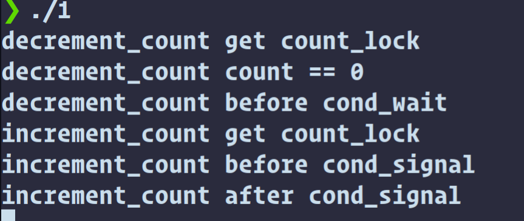
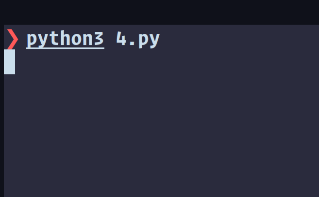
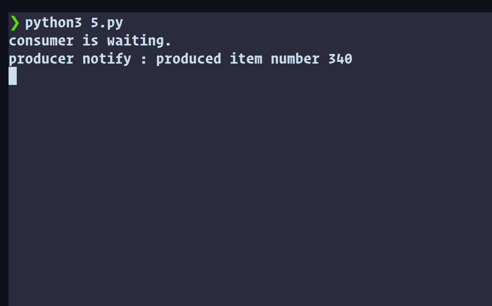
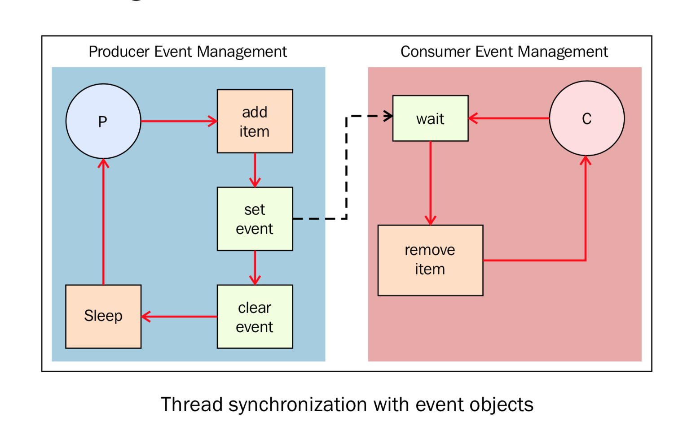

[TOC]

笔者环境：

$Ubuntu22.04$


# c/c++代码演示

### 互斥锁

用于控制多个线程对共享资源互斥访问的一个信号量。

在某一时刻，只有一个线程可以获取互斥锁，在释放互斥锁之前其他线程都不能获取该互斥锁。如果其他线程想要获取这个互斥锁，那么这个线程只能以阻塞方式进行等待.

首先在linux中找到pthread.h:

```shell
❯ sudo find / -name 'pthread.h'
find: ‘/proc/34311/task/34311/net’: 无效的参数
find: ‘/proc/34311/net’: 无效的参数
/home/heeler/anaconda3/pkgs/pycparser-2.20-py_2/site-packages/pycparser/utils/fake_libc_include/pthread.h
/home/heeler/anaconda3/lib/python3.9/site-packages/pycparser/utils/fake_libc_include/pthread.h
/home/heeler/.konan/dependencies/x86_64-unknown-linux-gnu-gcc-8.3.0-glibc-2.19-kernel-4.9-2/x86_64-unknown-linux-gnu/sysroot/usr/include/pthread.h
/usr/include/pthread.h
find: ‘/run/user/1000/doc’: 权限不够
find: ‘/run/user/1000/gvfs’: 权限不够
/var/lib/docker/overlay2/114f0e008a8f843b92acc114963f17219ba5d7f42e9863dd139ddfac338f9986/diff/usr/include/pthread.h
^C
```

查看代码：

```c
cp /usr/include/pthread.h /home/heeler/1.txt
```

下面代码删除了一些不必要的代码以及注释：

```c
/* Mutex handling.  */

/* Initialize a mutex.  */
//动态方式创建锁，
extern int pthread_mutex_init (pthread_mutex_t *__mutex,
			       const pthread_mutexattr_t *__mutexattr)
     __THROW __nonnull ((1));

/* Destroy a mutex.  */
//毁坏一个锁
extern int pthread_mutex_destroy (pthread_mutex_t *__mutex)
     __THROW __nonnull ((1));

/* Try locking a mutex.  */
//尝试锁上一个互斥体
extern int pthread_mutex_trylock (pthread_mutex_t *__mutex)
     __THROWNL __nonnull ((1));

/* Lock a mutex.  */
//锁上
extern int pthread_mutex_lock (pthread_mutex_t *__mutex)
     __THROWNL __nonnull ((1));

#ifdef __USE_XOPEN2K
/* Wait until lock becomes available, or specified time passes. */
//等待直到锁可用
# ifndef __USE_TIME_BITS64
extern int pthread_mutex_timedlock (pthread_mutex_t *__restrict __mutex,
				    const struct timespec *__restrict
				    __abstime) __THROWNL __nonnull ((1, 2));

#endif

/* Unlock a mutex.  */
//解锁
extern int pthread_mutex_unlock (pthread_mutex_t *__mutex)
     __THROWNL __nonnull ((1));
```

实际操作：

2.cpp

上锁：

```cpp
#include<pthread.h>
#include<iostream>
#include<unistd.h>

using namespace std;

pthread_mutex_t mutex1;

void *myid1(void *arg)
{
    pthread_mutex_lock(&mutex1);//上锁
    for(int i=0;i<5;i++)
    {
        sleep(1);
        cout<<"myid111111"<<endl;
    }
    pthread_mutex_unlock(&mutex1);//开锁
}

void *myid2(void *arg)
{
    pthread_mutex_lock(&mutex1);
    for(int i=0;i<5;i++)
    {
        sleep(1);
        cout<<"myid222222"<<endl;
    }
    pthread_mutex_unlock(&mutex1);
}

void *myid3(void *arg)
{
    pthread_mutex_lock(&mutex1);
    for(int i=0;i<5;i++)
    {
        sleep(1);
        cout<<"myid333333"<<endl;
    }
    pthread_mutex_unlock(&mutex1);
}

int main(int argc, char** argv)
{
    pthread_t id1,id2,id3;
    pthread_mutex_init(&mutex1,NULL);//初始化互斥锁
    
    pthread_create(&id1,NULL,myid1,NULL);
    pthread_create(&id2,NULL,myid2,NULL);
    pthread_create(&id3,NULL,myid3,NULL);    
    
    pthread_exit(&id1);
    pthread_exit(&id2);
    pthread_exit(&id3);

    pthread_mutex_destroy(&mutex1);//释放互斥锁
}
```

```cpp
❯ ./2
myid111111
myid111111
myid111111
myid111111
myid111111
myid222222
myid222222
myid222222
myid222222
myid222222
myid333333
myid333333
myid333333
myid333333
myid333333
```

删除2的锁：

```cpp
#include<pthread.h>
#include<iostream>
#include<unistd.h>

using namespace std;

pthread_mutex_t mutex1;

void *myid1(void *arg)
{
    pthread_mutex_lock(&mutex1);//上锁
    for(int i=0;i<5;i++)
    {
        sleep(1);
        cout<<"myid111111"<<endl;
    }
    pthread_mutex_unlock(&mutex1);//开锁
}

void *myid2(void *arg)
{
    //pthread_mutex_lock(&mutex1);
    for(int i=0;i<5;i++)
    {
        sleep(1);
        cout<<"myid222222"<<endl;
    }
    //pthread_mutex_unlock(&mutex1);
}

void *myid3(void *arg)
{
    pthread_mutex_lock(&mutex1);
    for(int i=0;i<5;i++)
    {
        sleep(1);
        cout<<"myid333333"<<endl;
    }
    pthread_mutex_unlock(&mutex1);
}

int main(int argc, char** argv)
{
    pthread_t id1,id2,id3;
    pthread_mutex_init(&mutex1,NULL);//初始化互斥锁
    
    pthread_create(&id1,NULL,myid1,NULL);
    pthread_create(&id2,NULL,myid2,NULL);
    pthread_create(&id3,NULL,myid3,NULL);    
    
    pthread_exit(&id1);
    pthread_exit(&id2);
    pthread_exit(&id3);

    pthread_mutex_destroy(&mutex1);//释放互斥锁
}
```

```cpp
❯ ./2
myid111111myid222222

myid111111
myid222222
myid111111myid222222

myid222222myid111111

myid222222myid111111

myid333333
myid333333
myid333333
myid333333
myid333333
```

### 条件互斥锁

某一个线程因为某个条件为满足时可以使用条件变量使改程序处于阻塞状态。一旦条件满足以“信号量”的方式唤醒一个因为该条件而被阻塞的线程。

代码仍在pthread.h中，

下面代码删除了一些不必要的代码以及注释：

```c
/* Functions for handling conditional variables.  */

/* Initialize condition variable COND using attributes ATTR, or use
   the default values if later is NULL.  */
//动态初始化cond
extern int pthread_cond_init (pthread_cond_t *__restrict __cond,
			      const pthread_condattr_t *__restrict __cond_attr)
     __THROW __nonnull ((1));

/* Destroy condition variable COND.  */
//删除
extern int pthread_cond_destroy (pthread_cond_t *__cond)
     __THROW __nonnull ((1));

/* Wake up one thread waiting for condition variable COND.  */
//唤醒
extern int pthread_cond_signal (pthread_cond_t *__cond)
     __THROWNL __nonnull ((1));

/* Wake up all threads waiting for condition variables COND.  */
//唤醒
extern int pthread_cond_broadcast (pthread_cond_t *__cond)
     __THROWNL __nonnull ((1));

/* Wait for condition variable COND to be signaled or broadcast.
   MUTEX is assumed to be locked before.

   This function is a cancellation point and therefore not marked with
   __THROW.  */
//预先假设mutex被锁，等待收到signal或者broadcast发来信号而被唤醒
extern int pthread_cond_wait (pthread_cond_t *__restrict __cond,
			      pthread_mutex_t *__restrict __mutex)
     __nonnull ((1, 2));

/* Wait for condition variable COND to be signaled or broadcast until
   ABSTIME.  MUTEX is assumed to be locked before.  ABSTIME is an
   absolute time specification; zero is the beginning of the epoch
   (00:00:00 GMT, January 1, 1970).

   This function is a cancellation point and therefore not marked with
   __THROW.  */
# ifndef __USE_TIME_BITS64
extern int pthread_cond_timedwait (pthread_cond_t *__restrict __cond,
				   pthread_mutex_t *__restrict __mutex,
				   const struct timespec *__restrict __abstime)
     __nonnull ((1, 2, 3));
```

代码：

1.cpp

```cpp
#include <pthread.h>
#include <iostream>
#include <unistd.h>

using namespace std;

pthread_mutex_t count_lock;
pthread_cond_t count_nonzero;
unsigned count = 0;
//count是全局变量，通过count值来判断是否成功使用cs
void* decrement_count(void* arg)
{
 pthread_mutex_lock(&count_lock);
 cout << "decrement_count get count_lock" << endl;

 while (count == 0) {
  cout << "decrement_count count == 0" << endl;

  cout << "decrement_count before cond_wait" << endl;

  //测试代码一
  pthread_cond_wait(&count_nonzero, &count_lock);
  //cond_wait预先假设mutex被锁，等待收到signal或者broadcast发来信号而被唤醒
  cout << "decrement_count after cond_wait" << endl;
 }

 count = count + 1;

 pthread_mutex_unlock(&count_lock);

 return NULL;
}

void* increment_count(void* arg)
{
 pthread_mutex_lock(&count_lock);
 cout << "increment_count get count_lock" << endl;

 if (count == 0) {
  cout << "increment_count before cond_signal" << endl;
  //测试代码二
  pthread_cond_signal(&count_nonzero);
  //唤醒count_nonzero
  cout << "increment_count after cond_signal" << endl;
 }

 count = count + 1;

 pthread_mutex_unlock(&count_lock);

 return NULL;
}

int main()
{
 pthread_t tid1, tid2;

 pthread_mutex_init(&count_lock, NULL);
 pthread_cond_init(&count_nonzero, NULL);

 pthread_create(&tid1, NULL, decrement_count, NULL);
 sleep(2);

 pthread_create(&tid2, NULL, increment_count, NULL);
 sleep(2);

 pthread_join(tid1, NULL);
 pthread_join(tid2, NULL);
 pthread_mutex_destroy(&count_lock);
 pthread_cond_destroy(&count_nonzero);

 cout << "ok!" << endl;
}
```


正常：

```cpp
❯ g++ -o 1 1.cpp
❯ ./1
decrement_count get count_lock
decrement_count count == 0
decrement_count before cond_wait
increment_count get count_lock
increment_count before cond_signal
increment_count after cond_signal
decrement_count after cond_wait
ok!
```

在测试代码一处注释掉pthread_cond_wait,可以看到由于无法收到信号，decrement_count陷入死循环：

```cpp
decrement_count before cond_wait
decrement_count after cond_wait
decrement_count count == 0
decrement_count before cond_wait
decrement_count after cond_wait
decrement_count count == 0
decrement_count before cond_wait
decrement_count after cond_wait
decrement_count count == 0
decrement_count before cond_wait
decrement_count after cond_wait
decrement_count count == 0
decrement_count before cond_wait
```

在测试代码二处注释掉pthread_cond_signal：

可以看到由于无法唤醒卡在increnmemnt_count一步。




### 自旋锁

自旋锁是一种busy-waiting的锁。也就是说，如果T1正在使用自旋锁，而T2也去申请这个自旋锁，此时T2肯定得不到这个自旋锁。与互斥锁相反的是，此时运行T2的处理器core2会一直不断地循环检查锁是否可用（自旋锁请求），直到获取到这个自旋锁为止。

然而c++中似乎并没有spin相关头文件，在/usr/include中并没有相关的.h头文件

# python代码演示

### 互斥锁

代码3.py:

```py
import threading
def job1():
    global n, lock
    # 获取锁
    lock.acquire()
    for i in range(10):
        n += 1
        print('job1', n)
    lock.release()


def job2():
    global n, lock
    # 获取锁
    lock.acquire()
    for i in range(10):
        n += 10
        print('job2', n)
    lock.release()

n = 0
# 生成锁对象
lock = threading.Lock()

t1 = threading.Thread(target=job1)
t2 = threading.Thread(target=job2)
t1.start()
t2.start()
```

```c
❯ python3 3.py
job1 1
job1 2
job1 3
job1 4
job1 5
job1 6
job1 7
job1 8
job1 9
job1 10
job2 20
job2 30
job2 40
job2 50
job2 60
job2 70
job2 80
job2 90
job2 100
job2 110
```

注释后：

```c
❯ python3 3.py
job1 1
job1 2
job1 13
job1 14
job1 15
job1 16
job1 17
job2 12
job1 18
job2 28
job2 39
job2 49
job2 59
job1 29
job2 70
job2 80
job2 90
job1 60
job2 100
job2 110
```

### 可重入锁

有时候在同一个线程中，我们可能会多次请求同一资源（就是，获取同一锁钥匙），俗称锁嵌套。

如果还是按照常规的做法，会造成死锁的

代码4.py:

```python
import threading

def main():
    n = 0
    # 生成可重入锁对象
    lock = threading.RLock()
    with lock:
        for i in range(10):
            n += 1
            with lock:
                print(n)

t1 = threading.Thread(target=main)
t1.start()
```

结果：

```c
❯ python3 4.py
1
2
3
4
5
6
7
8
9
10
```

RLock换为lock:



死锁，没有输出

### 信号量

代码5.py:

```python
# -*- coding: utf-8 -*-

"""Using a Semaphore to synchronize threads"""
import threading
import time
import random

# The optional argument gives the initial value for the internal
# counter;
# it defaults to 1.
# If the value given is less than 0, ValueError is raised.
# 信号量
semaphore = threading.Semaphore(0)

def consumer():
        print("consumer is waiting.")
        # Acquire a semaphore
        # 确认一个信号量
        semaphore.acquire()
        # The consumer have access to the shared resource
        print("Consumer notify : consumed item number %s " % item)

def producer():
        global item
        time.sleep(10)
        # create a random item
        item = random.randint(0, 1000)
        print("producer notify : produced item number %s" % item)
         # Release a semaphore, incrementing the internal counter by one.
        # When it is zero on entry and another thread is waiting for it
        # to become larger than zero again, wake up that thread.
        # 释放
        semaphore.release()

if __name__ == '__main__':
        for i in range (0,5) :
                t1 = threading.Thread(target=producer)
                t2 = threading.Thread(target=consumer)
                t1.start()
                t2.start()
                t1.join()
                t2.join()
        print("program terminated")
```


结果：

```
python3 5.py
consumer is waiting.
producer notify : produced item number 448
Consumer notify : consumed item number 448 
consumer is waiting.
producer notify : produced item number 827
Consumer notify : consumed item number 827 
consumer is waiting.
producer notify : produced item number 767
Consumer notify : consumed item number 767 
consumer is waiting.
producer notify : produced item number 978
Consumer notify : consumed item number 978 
consumer is waiting.
producer notify : produced item number 870
Consumer notify : consumed item number 870 
program terminated
```

注释后死锁：



### 条件量

代码6.py

```python
from threading import Thread, Condition
import time

items = []
# 条件量
condition = Condition()

class consumer(Thread):

    def __init__(self):
        #初始化线程
        Thread.__init__(self)

    def consume(self):
        global condition
        global items
        #确认条件量
        condition.acquire()
        if len(items) == 0:
            # 等待
            condition.wait()
            print("Consumer notify : no item to consume")
        items.pop()
        print("Consumer notify : consumed 1 item")
        print("Consumer notify : items to consume are " + str(len(items)))
        # 其他线程notify后重新尝试获得锁
        condition.notify()
        condition.release()

    def run(self):
        for i in range(0, 20):
            time.sleep(2)
            self.consume()
# 和消费者同理
class producer(Thread):

    def __init__(self):
        Thread.__init__(self)

    def produce(self):
        global condition
        global items
        condition.acquire()
        if len(items) == 10:
            condition.wait()
            print("Producer notify : items producted are " + str(len(items)))
            print("Producer notify : stop the production!!")
        items.append(1)
        print("Producer notify : total items producted " + str(len(items)))
        condition.notify()
        condition.release()

    def run(self):
        for i in range(0, 20):
            time.sleep(1)
            self.produce()

if __name__ == "__main__":
    producer = producer()
    consumer = consumer()
    producer.start()
    consumer.start()
    producer.join()
    consumer.join()
```

结果：

```c
❯ python3 6.py
Producer notify : total items producted 1
Consumer notify : consumed 1 item
Consumer notify : items to consume are 0
Producer notify : total items producted 1
Producer notify : total items producted 2
Consumer notify : consumed 1 item
Consumer notify : items to consume are 1
Producer notify : total items producted 2
Producer notify : total items producted 3
Consumer notify : consumed 1 item
Consumer notify : items to consume are 2
Producer notify : total items producted 3
Producer notify : total items producted 4
Consumer notify : consumed 1 item
Consumer notify : items to consume are 3
Producer notify : total items producted 4
Producer notify : total items producted 5
Consumer notify : consumed 1 item
Consumer notify : items to consume are 4
Producer notify : total items producted 5
Producer notify : total items producted 6
Consumer notify : consumed 1 item
Consumer notify : items to consume are 5
Producer notify : total items producted 6
Producer notify : total items producted 7
Consumer notify : consumed 1 item
Consumer notify : items to consume are 6
Producer notify : total items producted 7
Producer notify : total items producted 8
Consumer notify : consumed 1 item
Consumer notify : items to consume are 7
Producer notify : total items producted 8
Producer notify : total items producted 9
Consumer notify : consumed 1 item
Consumer notify : items to consume are 8
Producer notify : total items producted 9
Producer notify : total items producted 10
Consumer notify : consumed 1 item
Consumer notify : items to consume are 9
Producer notify : total items producted 10
Consumer notify : consumed 1 item
Consumer notify : items to consume are 9
Consumer notify : consumed 1 item
Consumer notify : items to consume are 8
Consumer notify : consumed 1 item
Consumer notify : items to consume are 7
Consumer notify : consumed 1 item
Consumer notify : items to consume are 6
Consumer notify : consumed 1 item
Consumer notify : items to consume are 5
Consumer notify : consumed 1 item
Consumer notify : items to consume are 4
Consumer notify : consumed 1 item
Consumer notify : items to consume are 3
Consumer notify : consumed 1 item
Consumer notify : items to consume are 2
Consumer notify : consumed 1 item
Consumer notify : items to consume are 1
Consumer notify : consumed 1 item
Consumer notify : items to consume are 0
```

### 事件同步

代码7.py

```python
import time
from threading import Thread, Event
import random
items = []
event = Event()

class consumer(Thread):
    def __init__(self, items, event):
        Thread.__init__(self)
        self.items = items
        self.event = event

    def run(self):
        while True:
            time.sleep(2)
            self.event.wait()
            item = self.items.pop()
            print('Consumer notify : %d popped from list by %s' % (item, self.name))

class producer(Thread):
    def __init__(self, items, event):
        Thread.__init__(self)
        self.items = items
        self.event = event

    def run(self):
        global item
        for i in range(100):
            time.sleep(2)
            item = random.randint(0, 256)
            self.items.append(item)
            print('Producer notify : item N° %d appended to list by %s' % (item, self.name))
            print('Producer notify : event set by %s' % self.name)
            self.event.set()
            print('Produce notify : event cleared by %s '% self.name)
            self.event.clear()

if __name__ == '__main__':
    t1 = producer(items, event)
    t2 = consumer(items, event)
    t1.start()
    t2.start()
    t1.join()
    t2.join()
```

部分结果：

```c
❯ python3 7.py
Producer notify : item N° 93 appended to list by Thread-1
Producer notify : event set by Thread-1
Produce notify : event cleared by Thread-1 
Producer notify : item N° 15 appended to list by Thread-1
Producer notify : event set by Thread-1
Produce notify : event cleared by Thread-1 
Consumer notify : 15 popped from list by Thread-2
Producer notify : item N° 74 appended to list by Thread-1
Producer notify : event set by Thread-1
Produce notify : event cleared by Thread-1 
Producer notify : item N° 221 appended to list by Thread-1
Producer notify : event set by Thread-1
Produce notify : event cleared by Thread-1 
Consumer notify : 221 popped from list by Thread-2
Producer notify : item N° 148 appended to list by Thread-1
Producer notify : event set by Thread-1
Produce notify : event cleared by Thread-1 
Consumer notify : 148 popped from list by Thread-2
```

代码解释：



# 参考

主要参考 [网站](https://python-parallel-programmning-cookbook.readthedocs.io/zh_CN/latest/chapter2/10_Thread_synchronization_with_an_event.html)


