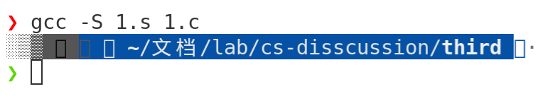
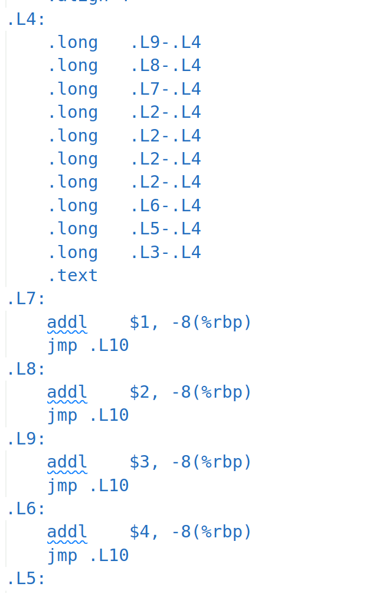
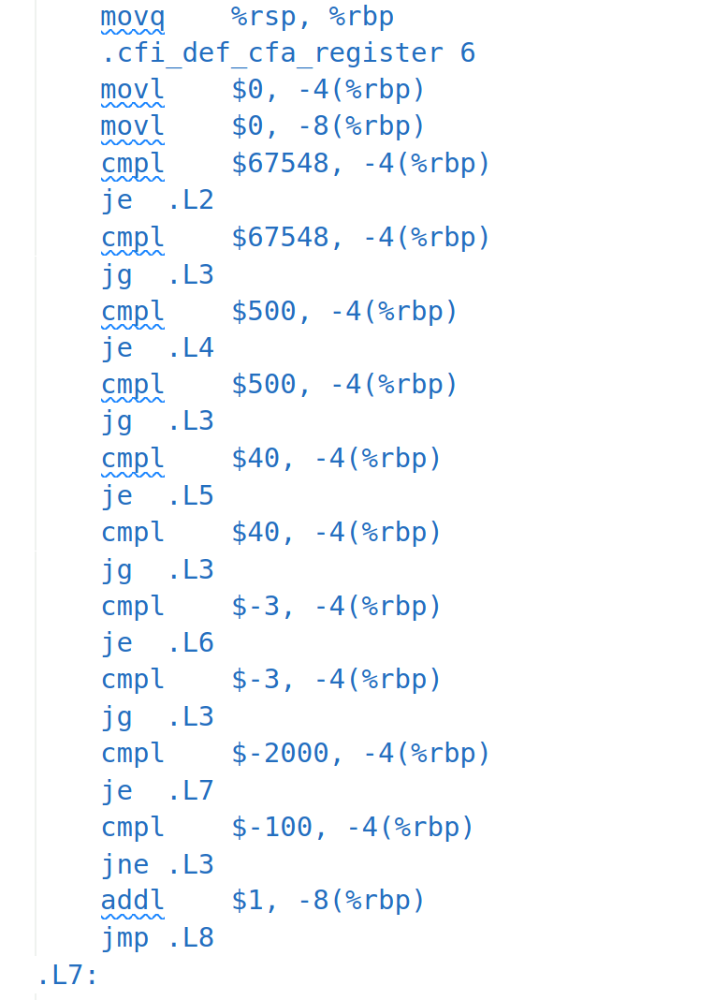
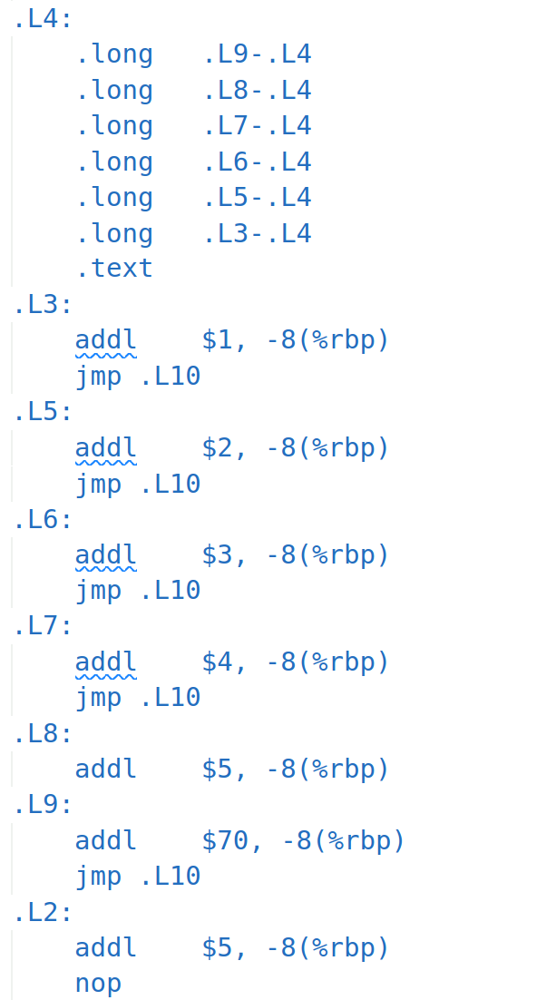
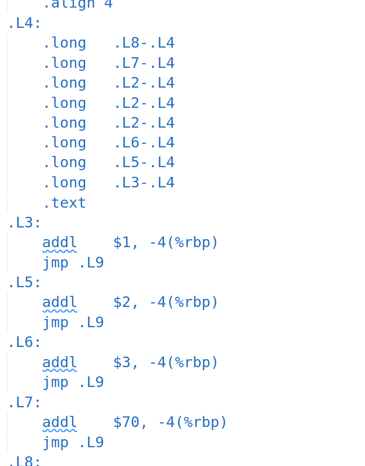

[TOC]

# 跳转指令

## 跳转表

先编译后得到[1.s](./1.s)，分析代码。



```
	.file	"1.c"
	.text
	.globl	main
	.type	main, @function
main:
.LFB0:
	.cfi_startproc
	endbr64
	pushq	%rbp
	.cfi_def_cfa_offset 16
	.cfi_offset 6, -16
	movq	%rsp, %rbp
	.cfi_def_cfa_register 6
	movl	$0, -4(%rbp)
	movl	$0, -8(%rbp)
	cmpl	$6, -4(%rbp)
	ja	.L2
	movl	-4(%rbp), %eax
	leaq	0(,%rax,4), %rdx
	leaq	.L4(%rip), %rax
	movl	(%rdx,%rax), %eax
	cltq
	leaq	.L4(%rip), %rdx
	addq	%rdx, %rax
	notrack jmp	*%rax
	.section	.rodata
	.align 4
	.align 4
.L4:
	.long	.L2-.L4
	.long	.L9-.L4
	.long	.L8-.L4
	.long	.L7-.L4
	.long	.L6-.L4
	.long	.L5-.L4
	.long	.L3-.L4
	.text
.L9:
	addl	$1, -8(%rbp)
	jmp	.L10
.L8:
	addl	$2, -8(%rbp)
	jmp	.L10
.L7:
	addl	$3, -8(%rbp)
	jmp	.L10
.L6:
	addl	$4, -8(%rbp)
	jmp	.L10
.L5:
	addl	$5, -8(%rbp)
.L3:
	addl	$70, -8(%rbp)
	jmp	.L10
.L2:
	addl	$5, -8(%rbp)
	nop
.L10:
	movl	$0, %eax
	popq	%rbp
	.cfi_def_cfa 7, 8
	ret
	.cfi_endproc
.LFE0:
	.size	main, .-main
	.ident	"GCC: (Ubuntu 11.2.0-7ubuntu2) 11.2.0"
	.section	.note.GNU-stack,"",@progbits
	.section	.note.gnu.property,"a"
	.align 8
	.long	1f - 0f
	.long	4f - 1f
	.long	5
0:
	.string	"GNU"
1:
	.align 8
	.long	0xc0000002
	.long	3f - 2f
2:
	.long	0x3
3:
	.align 8
4:
```

容易发现下面代码对应于c文件中的switch代码：

```
.L4:
	.long	.L2-.L4
	.long	.L9-.L4
	.long	.L8-.L4
	.long	.L7-.L4
	.long	.L6-.L4
	.long	.L5-.L4
	.long	.L3-.L4
	.text
.L9:
	addl	$1, -8(%rbp)
	jmp	.L10
.L8:
	addl	$2, -8(%rbp)
	jmp	.L10
.L7:
	addl	$3, -8(%rbp)
	jmp	.L10
.L6:
	addl	$4, -8(%rbp)
	jmp	.L10
.L5:
	addl	$5, -8(%rbp)
.L3:
	addl	$70, -8(%rbp)
	jmp	.L10
.L2:
	addl	$5, -8(%rbp)
	nop
.L10:
	movl	$0, %eax
	popq	%rbp
	.cfi_def_cfa 7, 8
	ret
	.cfi_endproc
```

来看汇编代码：

```
	movl	$0, -4(%rbp)
	movl	$0, -8(%rbp)
```

14,15行这两句赋值i,j等于0，

```
	cmpl	$6, -4(%rbp)
	ja	.L2
```

接下来判断i与6的大小，大于6则跳转到.L2,

```
.L2:
	addl	$5, -8(%rbp)
	nop
```

也就是default;    之后我们假设i<=6,继续执行汇编（此处代码我的和你们的应该不同）：

```
	movl	-4(%rbp), %eax
	leaq	0(,%rax,4), %rdx
	leaq	.L4(%rip), %rax
	movl	(%rdx,%rax), %eax
	cltq
	leaq	.L4(%rip), %rdx
	addq	%rdx, %rax
	notrack jmp	*%rax
	.section	.rodata
	.align 4
	.align 4
```

上面代码把i存到%eax,

把4*%rax给%rdx,

把%rip+上.L4后给%rax,

把rax+rdx给eax,

把eax给rax,

把rip+.L4给rdx

把rax加上rdx,

上面相当于把rax=rip+.L4+4*rax+rip+.L4

之后跳转到rax为地址的地方，然后执行分支代码，执行完毕后退出switch

## 调整分支

调整为625341（2.c），跳转表如下：

```
.L4:
	.long	.L2-.L4
	.long	.L9-.L4
	.long	.L8-.L4
	.long	.L7-.L4
	.long	.L6-.L4
	.long	.L5-.L4
	.long	.L3-.L4
	.text
.L3:
	addl	$1, -8(%rbp)
	jmp	.L10
.L8:
	addl	$2, -8(%rbp)
	jmp	.L10
.L5:
	addl	$3, -8(%rbp)
	jmp	.L10
.L7:
	addl	$4, -8(%rbp)
	jmp	.L10
.L6:
	addl	$5, -8(%rbp)
.L9:
	addl	$70, -8(%rbp)
	jmp	.L10
.L2:
	addl	$5, -8(%rbp)
	nop
```

可以发现：当c程序case情况相同，而顺序不一样时，汇编结果的跳转表里的地址仍旧按照case的值0-6从小到大保存，只是后续的汇编代码按照case值的顺序排列，default分支.L2仍旧在最后。在我的电脑中，case 1对应.L9, case 2对应.L8,case 3 对应.L7,依次类推。

## 分支条件分析

### -1 -2 -3 4 5 6

生成跳转表(3.c)：



### -100 -2000 -3 40 500 67548

未生成跳转表（4.c）:



### -1 -2 -3 -4 -5 -6

生成跳转表（5.c）:



分析：

switch语句汇编时通常根据开关数量和稀疏程度汇编分成以下5种情况：

  1.当分支比较少时（6.c的case -1）或分支很多但分支常量杂乱无规律时(4.c的-100 -2000 -3 40 500 67548) ，汇编成cmpl, je, jmp等指令结构。
  2.当分支比较多且分支常量连续时（5.c的-1 -2 -3 -4 -5 -6），生成一张大表。
  3.当分支比较多，分支常量连续但分支常量中间有少量断档时，生成一张大表，断档的分支在表中用default分支地址填充（7.c的-1 -2 -3 -4 -6）。
  4.当分支比较多，分支常量连续但分支常量中间有大量断档时，生成一张大表 ，断档的分支不在占用大表的空间，仅在大表中保留一份default分支的地址(8.c中的-1 -2 -3 -7 -8).



==同时考察不同的编译器是否有不同的行为。==

你们在你们的编译器上试一试。